# pyledger

---
# 1. Introduction
## 1.1. Purpose

This document describes the `pyledger` CLI application for Ledger, a CLI application that provides a double-entry accounting system.

## 1.2. Audience

The audience for this document includes:

* Developer who will develop the application, run unit tests, configure build tools and write user documentation.

* DevSecOps Engineer who will shape the workflow, and write playbooks and runbooks.

---
# 2. System Overview
## 2.1. Benefits and Values

1. Currently, creating a Ledger input requires the User to enter a debit and credit record for each transaction, which may be inefficient and error prone.

2. The `pyledger` allows the User to create a rules file that will govern the transformation process of an input file to an output file, hence reducing the error rate, while increasing the reusability and adding version control for a configuration as code.

3. The rules will be evaluated in order of sequence, i.e. the first rule has higher precedence over the other rules, etc.

## 2.2. Workflow

This project uses several methods and products to optimize your workflow.

* Use a version control system (**GitHub**) to track your changes and collaborate with others.
* Use a cloud LLM (**ChatGPT**) to facilitate shaping and writing playbook and runbooks.
* Use a diagram as code tool (**Mermaid**) to draw any system design or diagram.
* Use a Python LLM-enabled CLI (**Aider.chat**) to facilitate coding.
* Use a VS Code LLM-enabled extension (**Pythagora**) to facilitate coding.
* Use a build tool (**Makefile**) to automate your build tasks.
* Use a package manager (**pipenv**) to manage your dependencies.
* Use a testing framework (**pytest**) to automate your testing.
* Use a linter (**check-jsonschema**) to lint the rules YAML file.
* Use a containerization platform (**Docker**) to run your application in any environment.

## 2.3. Roadmap

This project has the following tasks planned for its roadmap:

## 2.4. Trace Python Main Application

```mermaid
%%{ init: { 'theme': 'dark' } }%%
gantt
    title Trace Showing Python Main Application
    dateFormat x
    axisFormat %S.%L

    section ledger.py
    main                                : 0, 900ms
    Typer.parse_argument                : crit, code1, 0, 100ms
    Processor.__init__                  : code2, after code1, 400ms
    Processor.load_rules                : code3, after code1, 100ms
    Processor.get_headers               : code4, after code3, 100ms
    Processor.__get_first_row           : code5, after code4, 100ms
    Processor.load_input_files          : after code5, 100ms
    Processor.sort_transactions         : code6, after code2, 100ms
    Processor.normalize_transactions    : code7, after code6, 100ms
    Processor.transform_transactions    : code8, after code7, 100ms
    file.write                          : after code8, 100ms
```



### Feature

* Add `output.amount.prefix` to allow customisable prefix for the output amount, e.g. `$`.
* Add `output.filename` to allow customisable output filename, e.g. `output.txt`.

### Fix

* Replace any special characters and UPPER case letters within `description` with spaces and small case letters.

---
# 3. User Personas
## 3.1 RACI Matrix

|            Category            |                        Activity                        | Developer | DevSecOps |
|:------------------------------:|:------------------------------------------------------:|:---------:|:---------:|
| Installation and Configuration | [Configure `aider.chat` in your local repository][t01] |           |    R,A    |
| Installation and Configuration | [Configure `gpt-pilot` in your local workstation][t02] |           |    R,A    |
| Installation and Configuration |          [Create the project structure][t03]           |           |    R,A    |
| Installation and Configuration |               [Create a `Makefile`][t04]               |           |    R,A    |
| Installation and Configuration |  [Use `check-jsonschema` to validate your rules][t05]  |           |    R,A    |
|       Shaping by GPT-4o        |           [Create a `conftest.py` file][t06]           |    R,A    |           |
|       Shaping by GPT-4o        |            [Create and run unit tests][t07]            |    R,A    |           |
|       Shaping by GPT-4o        |         [Create a main `ledger.py` file][t08]          |    R,A    |           |
|           Execution            |     [Run `ledger.py` on a CSV or an XLS file][t09]     |           |    R,A    |

[t01]: #51-configure-aiderchat-in-your-local-repository
[t02]: #52-configure-gpt-pilot-in-your-local-workstation
[t03]: #53-create-the-project-structure
[t04]: #54-create-a-makefile
[t05]: #55-use-check-jsonschema-to-validate-your-rules
[t06]: #61-create-a-conftestpy-file
[t07]: #62-create-and-run-unit-tests
[t08]: #63-create-a-main-ledgerpy-file
[t09]: #71-run-ledgerpy-on-a-csv-or-an-xls-file

---
# 4. Requirements
## 4.1. Local workstation

- `aider-chat` 0.36.0 (python3 -m pip install)
- `check-jsonschema` version 0.26.1 (python3 -m pip install)
- Python 3.11.6 (`/opt/homebrew/bin/python3`)
  - `pandas==2.2.2` (`pipenv install`)
  - `typer==0.12.3` (`pipenv install`)
  - `pyyaml==6.0.1` (`pipenv install`)
  - `openpyxl==3.1.3` (`pipenv install`)
  - `pytest==8.2.2` (`pipenv install --dev`)
- Visual Studio Code
  - Pythagora extension (`gpt-pilot`)

## 4.2. SaaS accounts

- GitHub account
- OpenAI ChatGPT API account

---
# 5. Installation and Configuration
## 5.1. Configure `aider.chat` in your local repository

This runbook should be performed by the DevSecOps Engineer.

<details>
    <summary>Click here to configure aider.chat in your local repository.</strong></summary>

1. Open a bash terminal and navigate to your workspace > type the following command.

```sh
git clone https://github.com/dennislwm/pyledger
```

2. Create an file `.env` in your editor and copy and paste the content below, replacing the `<TOKEN>` with your API token.

```txt
export OPENAI_API_KEY=<TOKEN>
```

3. Create an `.aider.conf.yml` file, replace the `<MODEL>` with an LLM model, e.g. `openai/gpt-4o-mini`.

```yml
##########################################################
# Sample .aider.conf.yml
# This file lists *all* the valid configuration entries.
# Place in your home dir, or at the root of your git repo.
##########################################################

# Note: You can only put OpenAI and Anthropic API keys in the yaml
# config file. Keys for all APIs can be stored in a .env file
# https://aider.chat/docs/config/dotenv.html

#######
# Main:

## Specify the model to use for the main chat
model: <MODEL>
```

4. Navigate to your local repository `pyledger`, and type the command:

```sh
source .env
aider --version
```

</details>


> Note: You do not need to launch a virtual environment, if the package `aider-chat` was `pip` installed globally.

## 5.2. Configure `gpt-pilot` in your local workstation

This runbook should be performed by the DevSecOps Engineer.

<details>
    <summary>Click here to configure gpt-pilot in your local workstation.</strong></summary>

1. Open a file explore > navigate to your installation folder for the Pythagora VS Code extension.

```sh
~/Documents/Pythagora/gpt-pilot
```

2. Open `config.json` and replace the `<API_TOKEN>` with your API token. Optionally, replace the `<AGENT_MODEL>` with a specific model, e.g. `gpt-4o-mini`.

```json
{
  "llm": {
    "openai": {
      "api_key": "<API_TOKEN>",
    }
  },
  "agent": {
    "default": {
      "provider": "openai",
      "model": "`<AGENT_MODEL>",
    },
    "CodeMonkey": {
      "provider": "openai",
      "model": "`<AGENT_MODEL>",
    },
    "CodeMonkey.describe_files": {
      "provider": "openai",
      "model": "`<AGENT_MODEL>",
    }
  }
}
```

3. Restart your VS Code application > Open a new or existing project > Create a new feature branch.

4. Click on Pythagora in the left-hand menu > Click Create New App.
  - Project Name: `pyledger-v0.3`

5. For existing projects, click **Import An Existing Project**.
  - Pythagora copies your existing project to a new folder under its workspace  `~/Documents/Pythagora/gpt-pilot/workspace/`.

6. Ensure you delete any sensitive files in the project under Pythagora workspace.
  - `.env`

7. For new projects, follow and complete the prompts.

</details>


## 5.3. Create the project structure

This runbook should be performed by the Developer.

1. Create a new directory structure for your project with the following subdirectories and files.

```sh
pyledger/
|- .env
|- .gitignore
|- README.md
+- app/
   |- ledger.py
   |- Makefile
   +- tests/
      |- conftest.py
+- rules/
   |- rules_hsbc.yaml
```

## 5.4. Create a `Makefile`

This runbook should be performed by the Developer.

<details>
    <summary>Click here to create a app/Makefile file.</strong></summary>

1. Create a new file `app/Makefile`.

```Makefile
.PHONY: default install_new install_test run shell shell_clean test test_verbose

default: test

install_new:
	pipenv install pandas==2.2.2 pyyaml==6.0.1 openpyxl==3.1.3 typer==0.12.3
	pipenv install --dev pytest==8.2.2

run:
	python ledger.py

shell:
	pipenv shell

shell_clean:
	pipenv --rm

test:
	PYTHONPATH=.:../ pytest

test_verbose:
	PYTHONPATH=.:../ pytest -v -s
```

</details>


## 5.5. Use `check-jsonschema` to validate your rules

This runbook should be performed by the Developer.

The `app/schema.json` supports the following rules file in YAML format (Bold **`key`** means required):
- `input`: info for `<INPUT_FILE>`
  - `csv`: info for CSV file
    - `header`: header names
      - `date`: header name for date column (Default: `Date`)
      - `description`: header name for description column (Default: `Description`)
      - `amount`: header name for amount column (Default: `Amount`)
      - `withdraw`: header name for withdrawal column (Default: `Withdrawal`)
      - `deposit`: header name for deposit column (Default: `Deposit`)
  - `xls`: info for XLS file
    - `header`: header names (same as above)
    - `sheet`: info for XLS sheet
      - `first_row`: the first row in sheet to use as header (default: `1`)
- **`rules`**: rules applied to transform `<INPUT_FILE>` to `<OUTPUT_FILE>`
  - **`income`**: array of transformation rules for an income row to an output ledger record
    - `[-]`
      - **`transaction_type`**: regex string used to match one or more rows with the `<INPUT_FILE>` `description` column
      - `description`: description for ledger transaction (Default: value of the `<INPUT_FILE>` `description` column used)
      - **`debit_account`**: debit account for ledger transaction
      - **`credit_account`**: credit account for ledger transaction
  - **`expense`**: aarray of transformation rules for an expense row to an output ledger record (same as above)


<details>
    <summary>Click here to use check-jsonschema to validate your rules.</strong></summary>

1. Create a new file `app/schema.json`.

```json
{
  "$schema": "https://json-schema.org/draft/2020-12/schema",
  "type": "object",
  "additionalProperties": false,
  "properties": {
    "input": {
      "type": "object"
    },
    "rules": {
      "type": "object"
    }
  }
}
```

2. Create a `rules.yaml` file:

```yml
input:
  csv:
    header:
      date: " Transaction Date"
      description: "Description"
      amount: "Amount"
rules:
  income:
    - transaction_type: "Maturity of Fixed Deposit"
      debit_account: "Assets:AU:Savings:HSBC"
      credit_account: "Assets:AU:Term:HSBC:Aug23"
    - transaction_type: "Interest"
      debit_account: "Assets:AU:Savings:HSBC"
      credit_account: "Income:AU:Interest"
  expense:
    - transaction_type: "*"
      debit_account: "Expenses:AU"
      credit_account: "Assets:AU:Savings:HSBC"
```

3. Open a shell terminal > run the following command to lint your `rules.yaml` file.

```sh
check-jsonschema --schemafile schema.json rules.yaml
```

4. You can lint all files in a folder as follows:

```sh
check-jsonschema --schemafile schema.json rules/*
```

5. If there are no validation errors, you should see the following output:

```sh
ok -- validation done
```

</details>


---
# 6. Shaping by GPT-4o
## 6.1. Create a `conftest.py` file

This runbook should be performed by the Developer with the [help](./chat/openai.input.history.md#creating-unit-tests) of GPT-4o.

<details>
    <summary>Click here to create a app/tests/conftest.py file.</strong></summary>

1. Create a `app/tests/conftest.py` file.

```py
import pytest
import pandas as pd
import yaml
from typer.testing import CliRunner

@pytest.fixture
def sample_transactions():
    data = {
        "Date": ["2023/08/01", "2023/08/02"],
        "Description": ["Maturity of Fixed Deposit", "Interest"],
        "Amount": [70000, 1575]
    }
    return pd.DataFrame(data)

@pytest.fixture
def sample_rules():
    rules_yaml = """
    rules:
      - transaction_type: "Maturity of Fixed Deposit"
        debit_account: "Assets:AU:Savings:HSBC"
        credit_account: "Assets:AU:Term:HSBC:Aug23"
      - transaction_type: "Interest"
        debit_account: "Assets:AU:Savings:HSBC"
        credit_account: "Income:AU:Interest"
    """
    return yaml.safe_load(rules_yaml)

@pytest.fixture
def runner():
    return CliRunner()
```

</details>

## 6.2. Create and run unit tests

This runbook should be performed by the Developer with the [help](./chat/openai.input.history.md#create-unit-tests) of GPT-4o.

1. Create unit test files.

- **Testing function `load_input()`**

  <details>
      <summary>Click here to create a tests/test_load_input.py file.</strong></summary>

  ```py
  import pandas as pd
  import pytest

  from ledger import load_input_file

  def test_load_input_file_csv(tmp_path):
      csv_file = tmp_path / "input.csv"
      csv_file.write_text("Date,Description,Amount\n2023/08/01,Maturity of Fixed Deposit,70000\n2023/08/02,Interest,1575\n")
      df = load_input_file(csv_file)
      assert not df.empty
      assert df.shape == (2, 3)

  def test_load_input_file_xlsx(tmp_path):
      xlsx_file = tmp_path / "input.xlsx"
      df = pd.DataFrame({
          "Date": ["2023/08/01", "2023/08/02"],
          "Description": ["Maturity of Fixed Deposit", "Interest"],
          "Amount": [70000, 1575]
      })
      df.to_excel(xlsx_file, index=False)
      loaded_df = load_input_file(xlsx_file)
      assert not loaded_df.empty
      assert loaded_df.shape == (2, 3)
  ```

  </details>

- **Testing function `load_rules()`**

  <details>
      <summary>Click here to create a app/tests/test_load_rules.py file.</strong></summary>

  ```py
  def test_load_rules(tmp_path):
      yaml_file = tmp_path / "rules.yaml"
      rules_yaml = """
      rules:
        - transaction_type: "Maturity of Fixed Deposit"
          debit_account: "Assets:AU:Savings:HSBC"
          credit_account: "Assets:AU:Term:HSBC:Aug23"
        - transaction_type: "Interest"
          debit_account: "Assets:AU:Savings:HSBC"
          credit_account: "Income:AU:Interest"
      """
      yaml_file.write_text(rules_yaml)
      rules = load_rules(yaml_file)
      assert "rules" in rules
      assert len(rules["rules"]) == 2
  ```

  </details>

- **Testing function `transform_transactions()`**

  <details>
      <summary>Click here to create a app/tests/test_transform_transactions.py file.</strong></summary>

  ```py
  def test_transform_transactions(sample_transactions, sample_rules):
      output = transform_transactions(sample_transactions, sample_rules)
      assert len(output) == 2
      assert "2023/08/01 Maturity of Fixed Deposit" in output[0]
      assert "2023/08/02 Interest" in output[1]
  ```

  </details>

- **Testing function `main()`**

  <details>
      <summary>Click here to create a app/tests/test_main.py file.</strong></summary>

  ```py
  from ledger import app, main

  def test_main(tmp_path, runner):
      input_csv = tmp_path / "input.csv"
      rules_yaml = tmp_path / "rules.yaml"
      output_txt = tmp_path / "output.txt"

      input_csv.write_text("Date,Description,Amount\n2023/08/01,Maturity of Fixed Deposit,70000\n2023/08/02,Interest,1575\n")
      rules_yaml.write_text("""
      rules:
        - transaction_type: "Maturity of Fixed Deposit"
          debit_account: "Assets:AU:Savings:HSBC"
          credit_account: "Assets:AU:Term:HSBC:Aug23"
        - transaction_type: "Interest"
          debit_account: "Assets:AU:Savings:HSBC"
          credit_account: "Income:AU:Interest"
      """)

      result = runner.invoke(app, [str(input_csv), str(rules_yaml), str(output_txt)])
      assert result.exit_code == 0
      assert output_txt.read_text() == (
          "2023/08/01 Maturity of Fixed Deposit\n"
          "\tAssets:AU:Savings:HSBC                            70000\n"
          "\tAssets:AU:Term:HSBC:Aug23\n"
          "2023/08/02 Interest\n"
          "\tAssets:AU:Savings:HSBC                            1575\n"
          "\tIncome:AU:Interest"
      )
  ```

  </details>

2. Run the unit tests by typing `make test`.

```sh
PYTHONPATH=.:../ pytest -v -s
================================================= test session starts ==================================================
platform darwin -- Python 3.11.6, pytest-8.2.2, pluggy-1.5.0 -- /Users/dennislwm/.local/share/virtualenvs/app-M3_O-iuZ/bin/python
cachedir: .pytest_cache
rootdir: /Users/dennislwm/fx-git-pull/13pyledger/app
collected 5 items

tests/test_load_input.py::test_load_input_file_csv PASSED
tests/test_load_input.py::test_load_input_file_xlsx PASSED
tests/test_load_rules.py::test_load_rules PASSED
tests/test_main.py::test_main PASSED
tests/test_transform_transactions.py::test_transform_transactions PASSED

================================================== 5 passed in 0.05s ===================================================
```

## 6.3. Create a main `ledger.py` file

This runbook should be performed by the Developer with the [help](./chat/openai.input.history.md) of GPT-4o.

1. Create a `app/ledger.py` file.

  <details>
      <summary>Click here to create a app/ledger.py file.</strong></summary>

  ```sh
  import pandas as pd
  import yaml
  import typer
  from pathlib import Path

  app = typer.Typer()

  def load_input_file(file_path: Path):
      if file_path.suffix == '.csv':
          return pd.read_csv(file_path)
      elif file_path.suffix == '.xlsx':
          return pd.read_excel(file_path)
      else:
          raise ValueError("Unsupported file format. Please provide a CSV or XLSX file.")

  def load_rules(file_path: Path):
      with open(file_path, 'r') as file:
          return yaml.safe_load(file)

  def transform_transactions(transactions_df, rules):
      output = []
      for _, row in transactions_df.iterrows():
          date = row['Date']
          description = row['Description']
          amount = row['Amount']
          for rule in rules['rules']:
              if rule['transaction_type'] in description:
                  debit_account = rule['debit_account']
                  credit_account = rule['credit_account']
                  output.append(f"{date} {description}\n\t{debit_account:<50}{amount}\n\t{credit_account}")
                  break
      return output

  @app.command()
  def main(input_file: Path = typer.Argument(..., help="Path to the input CSV or XLSX file"),
          rules_file: Path = typer.Argument(..., help="Path to the rules YAML file"),
          output_file: Path = typer.Argument("output.txt", help="Path to the output TXT file")):
      transactions_df = load_input_file(input_file)
      rules = load_rules(rules_file)
      output = transform_transactions(transactions_df, rules)

      with open(output_file, 'w') as file:
          file.write("\n".join(output))

      typer.echo(f"Output has been saved to {output_file}")

  if __name__ == "__main__":
      app()
  ```

  </details>


---
# 7. Execution
## 7.1. Run `ledger.py` on a CSV or an XLS file

This runbook should be performed by the DevSecOps Engineer.

<details>
    <summary>Click here to run ledger.py on a CSV or an XLS file.</strong></summary>

1. Open a shell and run the command `python ledger.py <INPUT_FILE> <RULES_FILE>`. For example:

```sh
cd app
pipenv shell
python ledger.py ../input/input_hsbc.csv ../rules/rules_hsbc.yaml
```

2. If successful, you should see a new file `app/output.txt` that contains your ledger file.

</details>